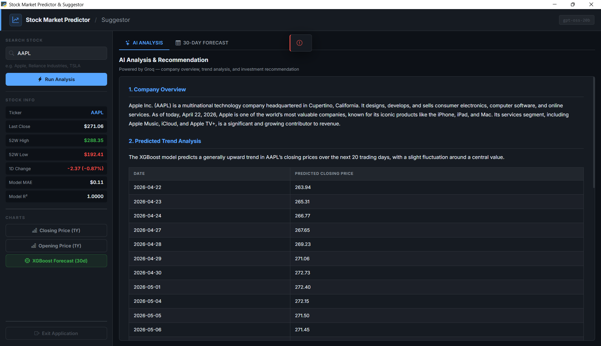
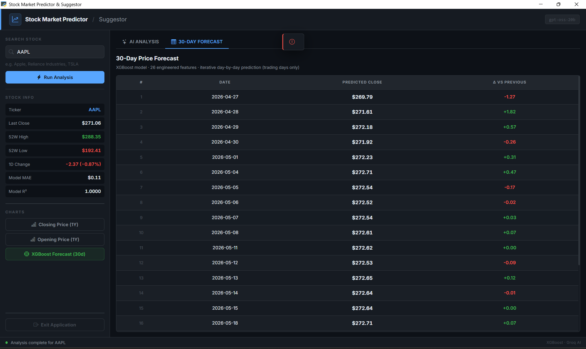
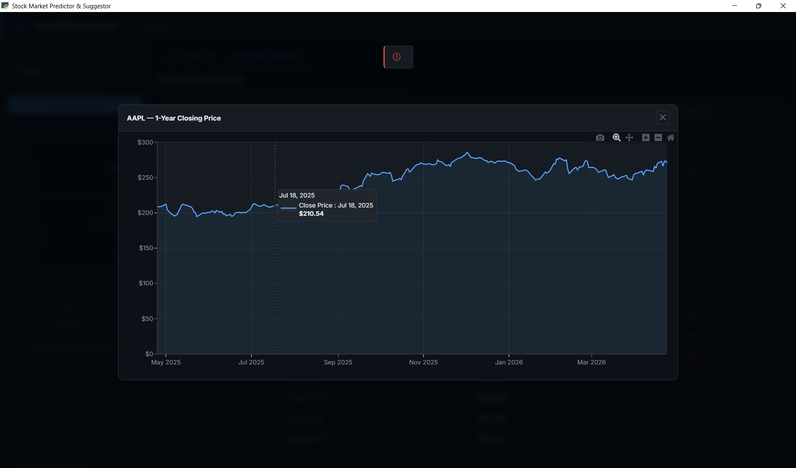
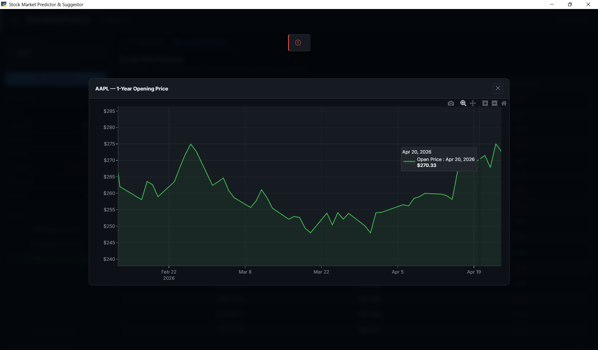
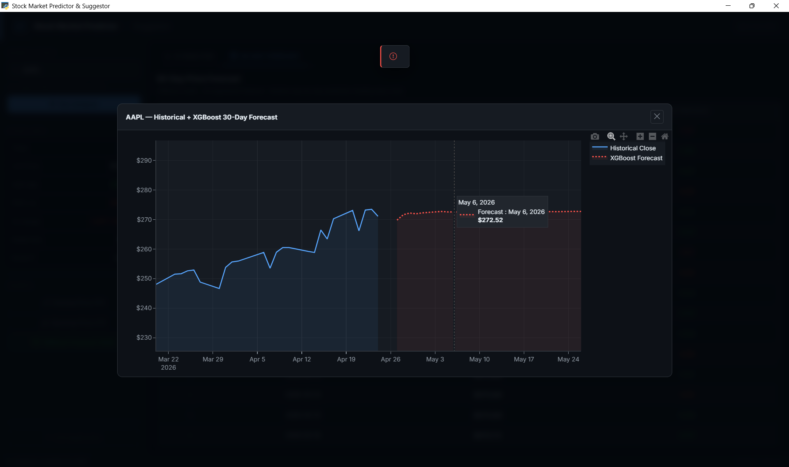

# Stock Market Predictor & Suggestor

> A desktop application that combines **XGBoost machine learning** with **Groq AI** to forecast stock prices and generate structured investment analysis — all inside a modern, web-based UI powered by `pywebview`.


---

## 📸 Screenshots

**AI Analysis Dashboard**


**ML Price Dashboard — 30-Day Forecast**


**1-Year Closing Price Chart**


**1-Year Opening Price Chart**


**XGBoost 30-Day Predicted Price**


---

## ✨ Features

| Feature | Description |
|---|---|
| 🔍 **Natural-language ticker resolution** | Type a company name (e.g. *"Apple"*, *"Reliance Industries"*) and the AI resolves the correct Yahoo Finance ticker automatically |
| 🤖 **XGBoost forecasting** | 26 engineered technical features trained on 1 year of daily OHLCV data; iteratively predicts the next **30 trading days** |
| 📊 **Interactive Plotly charts** | Zoomable, hoverable charts for 1-year closing price, 1-year opening price, and the 30-day XGBoost forecast overlay |
| 🧠 **AI analysis report** | Structured markdown analysis via Groq covering company overview, trend analysis, investment recommendation (Buy / Hold / Sell), key risks, and recent developments |
| ⚡ **AI response caching** | AI results stored in `ai_cache.json` — repeated lookups are instant and free |
| 🖥️ **Modern web UI** | Dark-themed pywebview window with Bootstrap Icons, Inter font, and Plotly.js — no Tkinter instability |

---

## 🛠️ Tech Stack

| Layer | Technology |
|---|---|
| Desktop window | `pywebview` (EdgeChromium / WebView2) |
| Charts | Plotly.js (CDN) |
| Markdown rendering | marked.js (CDN) |
| Icons | Bootstrap Icons (CDN) |
| Typography | Inter (Google Fonts CDN) |
| ML model | XGBoost + scikit-learn |
| Market data | yfinance (Yahoo Finance) |
| AI API | Groq (via OpenAI-compatible SDK) |

---

## 🚀 Installation

```bash
# 1. Clone the repository
git clone https://github.com/Priyanshu-Madhup/stock-market-predictor.git
cd stock-market-predictor

# 2. (Optional but recommended) Create a virtual environment
python -m venv .venv
.venv\Scripts\activate        # Windows
# source .venv/bin/activate   # macOS / Linux

# 3. Install Python dependencies
pip install -r requirements.txt

# 4. Configure your API keys (see Configuration below)
copy .env.example .env        # Windows
# cp .env.example .env        # macOS / Linux
```

---

## ⚙️ Configuration

Edit the `.env` file you just created:

```env
GROQ_API_KEY=your_groq_api_key_here
GROQ_MODEL=openai/gpt-oss-20b
```

| Variable | Where to get it | Recommended value |
|---|---|---|
| `GROQ_API_KEY` | [console.groq.com/keys](https://console.groq.com/keys) | — |
| `GROQ_MODEL` | [console.groq.com/docs/models](https://console.groq.com/docs/models) | `openai/gpt-oss-20b` |

> **Note:** Never commit your real `.env` file — it is already listed in `.gitignore`.

---

## ▶️ Usage

```bash
python app.py
```

1. Type a **company name or ticker symbol** in the search box (e.g. `Apple`, `TSLA`, `Reliance Industries`)
2. Click **Run Analysis** or press **Enter**
3. The pipeline will:
   - Resolve the ticker via AI
   - Fetch 1 year of daily price history from Yahoo Finance
   - Engineer 26 technical indicators and train the XGBoost model
   - Generate a 30-day iterative price forecast
   - Fetch (or load from cache) a structured AI analysis report
4. Switch between the **AI Analysis** tab and the **30-Day Forecast** tab instantly
5. Click any chart button in the sidebar to view interactive Plotly charts

---

## 📁 Project Structure

```
stock-market-predictor/
├── app.py              # Main application (single-file: Python backend + HTML/CSS/JS UI)
├── requirements.txt    # Python dependencies
├── .env.example        # Template for API keys — copy to .env and fill in
├── .env                # Your real API keys (git-ignored, never committed)
├── .gitignore          # Ignores secrets, cache, and build artefacts
├── screenshots/        # App screenshots (ss1.png – ss5.png)
│   ├── ss1.png         # AI Analysis dashboard
│   ├── ss2.png         # ML Price dashboard (30-day forecast table)
│   ├── ss3.png         # 1-Year closing price chart
│   ├── ss4.png         # 1-Year opening price chart
│   └── ss5.png         # XGBoost 30-day predicted price chart
├── ai_cache.json       # Auto-generated cache of AI responses (git-ignored)
└── README.md
```

---

## 🧠 How the ML Pipeline Works

```
Yahoo Finance (1Y OHLCV)
         │
         ▼
  Feature Engineering (26 features)
  ├─ Lag features       (Close_lag_1 … Close_lag_20)
  ├─ Moving averages    (SMA_5, SMA_10, SMA_20)
  ├─ Volatility         (STD_5, STD_10, STD_20)
  ├─ EMA / MACD / Signal
  ├─ RSI (14-period)
  ├─ Return_1d, Return_5d
  ├─ HL_spread, OC_spread
  └─ Volume_log (if available)
         │
         ▼
  XGBoost Regressor
  (600 estimators, lr=0.04, depth=6)
         │
         ▼
  Iterative 30-Day Forecast
  (each prediction fed back as next day's lag)
```

---

## 📋 Requirements

- **Python 3.10+**
- **Windows** — pywebview uses WebView2 (EdgeChromium) on Windows
- **Internet connection** — required for Yahoo Finance data fetching and Groq AI calls

---

## 📄 License

MIT © Priyanshu Madhup
